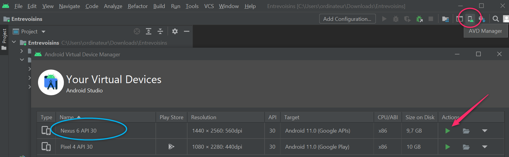

# OpenClassrooms

Ce dépôt contient une mini-application pour le P3 du parcours **Grande École du Numérique**.

télécharger sur : https://github.com/vigneaud-khalid/Entrevoisins/

1 _ cliquer sur le bouton code en vert puis sur download ZIP
    
2 _ décompresser l'archive
    
3 _ ouvrir Android Studio
    
4 _ dans le menu file, cliquer sur open
    
5 _ désigner son emplacement puis ouvrir
    
6 _ cliquer sur AVD Manager
    pour choisir un virtual device sur lequel faire tourner l'application
    et cliquer sur l'icone  en forme de flèche verte
    
